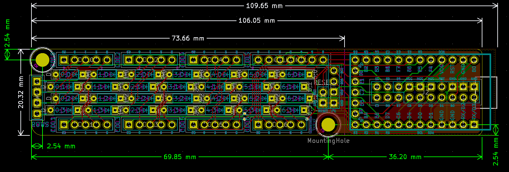

# SqueezeBar

This is a “matrix daughterboard” for handwired keyboards
using a socketed Pro Micro style microcontroller.
It's designed for Peter Lyons' [Squeezebox](https://peterlyons.com/problog/2022/10/squeezebox-keyboard-v2209/),
which has individual, swappable column modules,

This version supports up to 4 rows × 7 columns.
Here's a picture from Peter's blog -- an assembled Squeezebar
using just 5 of the columns:

You'll need two of these for a full keyboard.
The halves can either each have a controller and communicate over I2C,
or you can use one controller and connect using a cable with 11+ wires.
(Keep the same 7 columns, and pick unused pins for 4 more rows.)

## Pin Assignment

Pro Micro pin | Function
------------- | --------
F5            | Col 0
F6            | Col 1
F7            | Col 2
B1            | Col 3
B3            | Col 4
B2            | Col 5
B6            | Col 6
D7            | Row 0
B6            | Row 1
E4            | Row 2
B5            | Row 3
D0            | I²C SCL
D1            | I²C SDA

## Dimensions & Mounting

The board is about 110×21mm (hence the *Bar* in the name), with two M3 mounting holes.

## Discord

This thing grew in the [Absolem Club Discord](https://discord.gg/DbCfZfZ]),
in Peter's channel `#focusaurus`.
That's the best place to ask any questions.

*(Content warning: do not enter the Discord if you are allergic to weird keyboards.)*

## License

MIT
